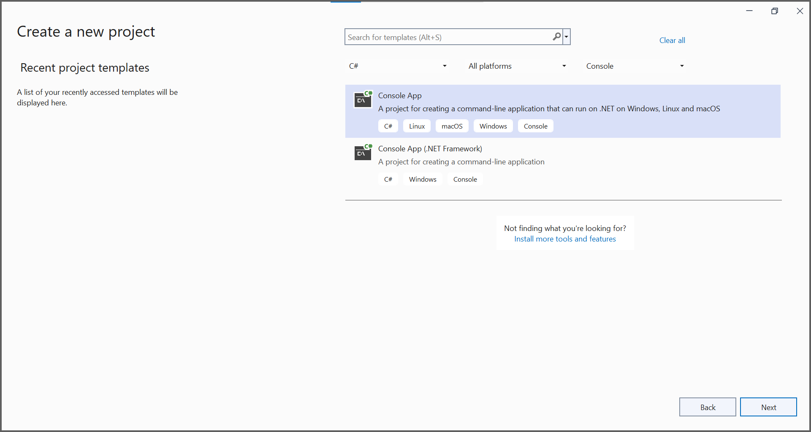
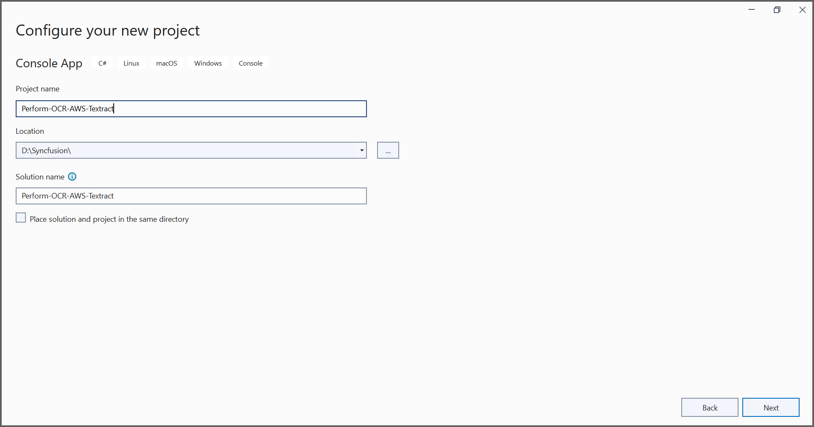
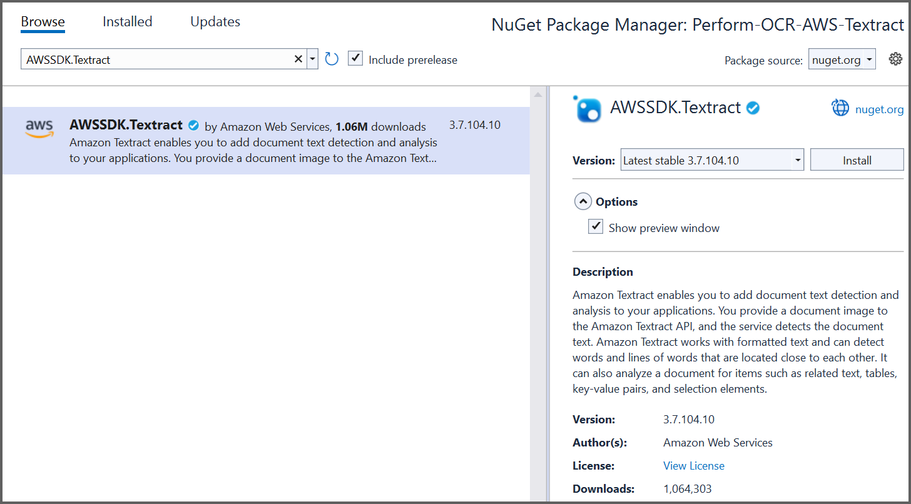

# Perform OCR with AWS Textract 
The [Syncfusion .NET OCR library](https://www.syncfusion.com/document-processing/pdf-framework/net/pdf-library/ocr-process) supports external engines (AWS Textract) to process the OCR on Images and PDF documents. 

## Steps to perform OCR with AWS Textract
1. Create a new .NET Console application project. 



2. Install [Syncfusion.PDF.OCR.NET](https://www.nuget.org/packages/Syncfusion.PDF.OCR.NET) and [AWSSDK.Textract](https://www.nuget.org/packages/AWSSDK.Textract) NuGet packages as reference to your .NET application from [nuget.org](https://www.nuget.org/). 



3. Include the following namespaces in the [Program.cs](Perform-OCR-AWS-Textract/Program.cs) file. 

```csharp
using Syncfusion.OCRProcessor;
using Syncfusion.Pdf.Parsing;
``` 

4. Use the following code sample to perform OCR on PDF document with AWS Textract in [Program.cs](Perform-OCR-AWS-Textract/Program.cs) file. 

```csharp
//Initialize the OCR processor.
using (OCRProcessor processor = new OCRProcessor())
{
    //Load an existing PDF document.
    FileStream stream = new FileStream("Region.pdf", FileMode.Open);
    PdfLoadedDocument lDoc = new PdfLoadedDocument(stream);
    //Set the OCR language.
    processor.Settings.Language = Languages.English;
    //Initialize the AWS Textract external OCR engine.
    IOcrEngine azureOcrEngine = new AWSExternalOcrEngine();
    processor.ExternalEngine = azureOcrEngine;
    //Perform OCR with input document.
    string text = processor.PerformOCR(lDoc);
    //Create file stream.
    FileStream fileStream = new FileStream("Output.pdf", FileMode.CreateNew);
    //Save the document into stream.
    lDoc.Save(fileStream);
    //Close the document.
    lDoc.Close();
    stream.Dispose();
    fileStream.Dispose();
}
```

5. Create a new class named [AWSExternalOcrEngine.cs](Perform-OCR-AWS-Textract/AWSExternalOcrEngine.cs) and implement the IOcrEngine interface. Get the image stream from PerformOCR method and process it with an external OCR engine. This will return the OCRLayoutResult for the image.

N> Provide a valid Access key and Secret Access Key to work with AWS Textract. 

```csharp

class AWSExternalOcrEngine : IOcrEngine
{
    private string awsAccessKeyId = "AccessKeyID";
    private string awsSecretAccessKey = "SecretAccessKey";
    private float imageHeight;
    private float imageWidth;
    public OCRLayoutResult PerformOCR(Stream stream)
    {
        AmazonTextractClient clientText = Authenticate();
        DetectDocumentTextResponse textResponse = GetAWSTextractResult(clientText, stream).Result;         
        OCRLayoutResult oCRLayoutResult = ConvertAWSTextractResultToOcrLayoutResult(textResponse);
        return oCRLayoutResult;
    }

    public AmazonTextractClient Authenticate()
    {
        AmazonTextractClient client = new AmazonTextractClient(awsAccessKeyId, awsSecretAccessKey, RegionEndpoint.USEast1);
        return client;
    }
    
    public async Task<DetectDocumentTextResponse> GetAWSTextractResult(AmazonTextractClient client, Stream stream)
    {
        stream.Position = 0;
        MemoryStream memoryStream = new MemoryStream();
        stream.CopyTo(memoryStream);
        PdfBitmap bitmap = new PdfBitmap(memoryStream);
        imageHeight = bitmap.Height;
        imageWidth = bitmap.Width;

        DetectDocumentTextResponse response = await client.DetectDocumentTextAsync(new DetectDocumentTextRequest
        {
            Document = new Document
            {
                Bytes = memoryStream
            }
        });
        return response;
    }
    
    public OCRLayoutResult ConvertAWSTextractResultToOcrLayoutResult(DetectDocumentTextResponse textResponse)
    {
        OCRLayoutResult layoutResult = new OCRLayoutResult();
        Syncfusion.OCRProcessor.Page ocrPage = new Page();
        Syncfusion.OCRProcessor.Line ocrLine;
        Syncfusion.OCRProcessor.Word ocrWord;
        layoutResult.ImageHeight = imageHeight;
        layoutResult.ImageWidth = imageWidth;
        foreach (var page in textResponse.Blocks)
        {                   
            ocrLine = new Line();
            if (page.BlockType == "WORD")
            {
                ocrWord = new Word();
                ocrWord.Text = page.Text;
                
                float left = page.Geometry.BoundingBox.Left;
                float top = page.Geometry.BoundingBox.Top;
                float width = page.Geometry.BoundingBox.Width;
                float height = page.Geometry.BoundingBox.Height;
                Rectangle rect = GetBoundingBox(left,top,width,height);
                ocrWord.Rectangle = rect;
                ocrLine.Add(ocrWord);
                ocrPage.Add(ocrLine);
            }               
        }
        layoutResult.Add(ocrPage);
        return layoutResult;
    }
    public Rectangle GetBoundingBox(float left, float top, float width, float height)
    {
        int x = Convert.ToInt32(left * imageWidth);
        int y = Convert.ToInt32(top * imageHeight);
        int bboxWidth = Convert.ToInt32((width * imageWidth) + x);
        int bboxHeight = Convert.ToInt32((height * imageHeight) + y);
        Rectangle rect = new Rectangle(x,y, bboxWidth, bboxHeight);
        return rect;
    }
}

```

By executing the program, you will get the PDF document as follows. 


