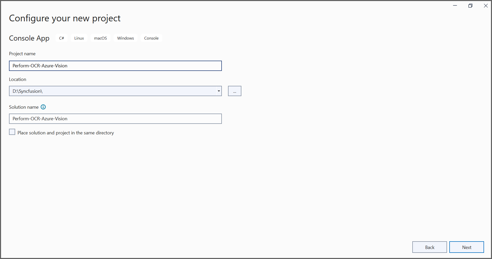
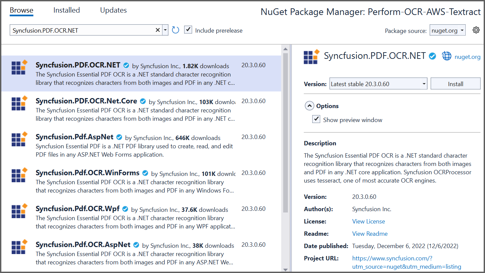
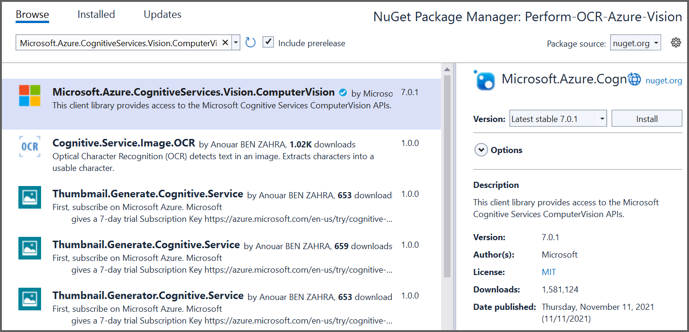
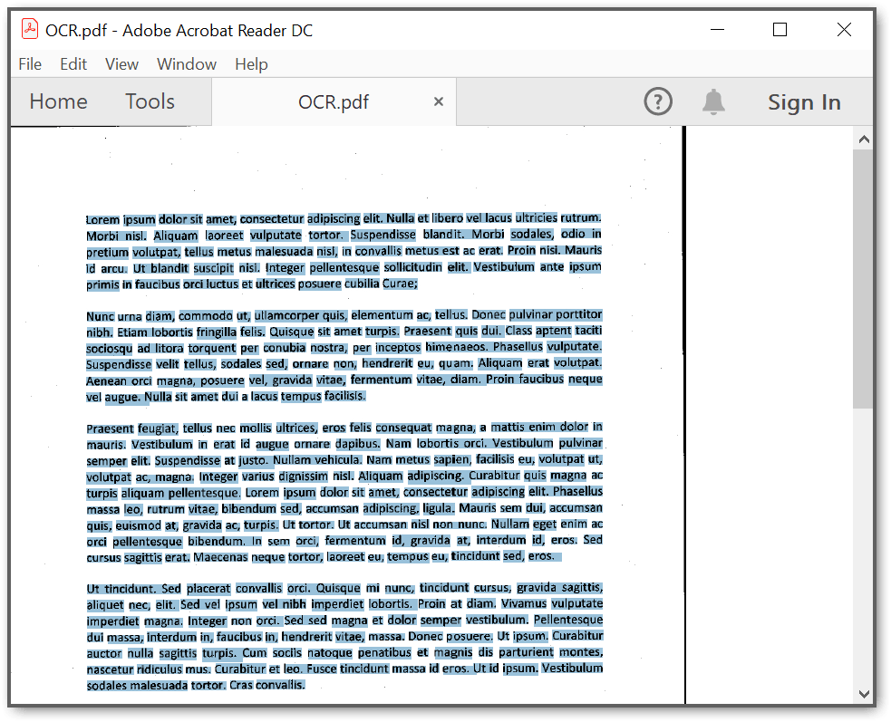

# Perform OCR with Azure Vision 

The [Syncfusion .NET OCR library](https://www.syncfusion.com/document-processing/pdf-framework/net/pdf-library/ocr-process) supports external engines (Azure Computer Vision) to process the OCR on images and PDF documents. 

## Steps to perform OCR with Azure Computer Vision 
1. Create a new .NET Console application project. 



2. Install [Syncfusion.PDF.OCR.NET](https://www.nuget.org/packages/Syncfusion.PDF.OCR.NET) and [Microsoft.Azure.CognitiveServices.Vision.ComputerVision](https://www.nuget.org/packages/Microsoft.Azure.CognitiveServices.Vision.ComputerVision) NuGet packages as reference to your .NET application from [nuget.org](https://www.nuget.org/). 




3. Include the following namespaces in the [Program.cs](Perform-OCR-Azure-Vision/Program.cs) file. 

```csharp
using Syncfusion.OCRProcessor;
using Syncfusion.Pdf.Parsing;
``` 

4. Use the following code sample to perform OCR on PDF document with Azure Vision in [Program.cs](Perform-OCR-Azure-Vision/Program.cs) file. 

```csharp

//Initialize the OCR processor.
using (OCRProcessor processor = new OCRProcessor())
{
    //Load an existing PDF document.
    FileStream stream = new FileStream("../../../Region.pdf", FileMode.Open);
    PdfLoadedDocument lDoc = new PdfLoadedDocument(stream);

    //Set OCR language.
    processor.Settings.Language = Languages.English;

    //Initialize the Azure vision OCR external engine.
    IOcrEngine azureOcrEngine = new AzureExternalOcrEngine();
    processor.ExternalEngine = azureOcrEngine;

    //Perform OCR.
    processor.PerformOCR(lDoc);

    //Create file stream.
    FileStream outputStream = new FileStream("../../../OCR.pdf", FileMode.CreateNew);

    //Save the document into stream.
    lDoc.Save(outputStream);

    //If the position is not set to '0' then the PDF will be empty. 
    outputStream.Position = 0;

    //Close the document. 
    lDoc.Close(true);
    outputStream.Close();
}

``` 

5. Create a new class named [AzureExternalOcrEngine](Perform-OCR-Azure-Vision/AzureExternalOcrEngine.cs) to get the image stream from PerformOCR method and process the image stream with an external engine. It returns the OCRLayoutResult for the image. 

N> Provide a valid subscription key and endpoint to work with Azure computer vision.

```csharp

class AzureExternalOcrEngine : IOcrEngine
{
    private string subscriptionKey = "SubscriptionKey";
    private string endpoint = "Endpoint link";
    public OCRLayoutResult PerformOCR(Stream imgStream)
    {
        ComputerVisionClient client = Authenticate();
        ReadResult azureOcrResult = ReadFileUrl(client, imgStream).Result;               
        OCRLayoutResult result = ConvertAzureVisionOcrToOcrLayoutResult(azureOcrResult);
        return result;
    }

    public ComputerVisionClient Authenticate()
    {
        ComputerVisionClient client = new ComputerVisionClient(new ApiKeyServiceClientCredentials(subscriptionKey))
        {
            Endpoint = endpoint
        };
        return client;
    }

    public async Task<ReadResult> ReadFileUrl(ComputerVisionClient client, Stream stream)
    {
        stream.Position = 0;
        var textHeaders = await client.ReadInStreamAsync(stream);
        string operationLocation = textHeaders.OperationLocation;
        const int numberOfCharsInOperationId = 36;
        string operationId = operationLocation.Substring(operationLocation.Length - numberOfCharsInOperationId);
        
        //Extract the text
        ReadOperationResult results;
        do
        {
            results = await client.GetReadResultAsync(Guid.Parse(operationId));
        }
        while ((results.Status == OperationStatusCodes.Running || results.Status == OperationStatusCodes.NotStarted));

        ReadResult azureOcrResult = results.AnalyzeResult.ReadResults[0];
        return azureOcrResult;
    }
    private OCRLayoutResult ConvertAzureVisionOcrToOcrLayoutResult(ReadResult azureVisionOcr)
    {
        Syncfusion.OCRProcessor.Line ocrLine;
        Syncfusion.OCRProcessor.Word ocrWord;
        
        OCRLayoutResult ocrlayoutResult = new OCRLayoutResult();         
        ocrlayoutResult.ImageWidth = (float)azureVisionOcr.Width;
        ocrlayoutResult.ImageHeight = (float)azureVisionOcr.Height;

        //Page
        Syncfusion.OCRProcessor.Page normalPage = new Syncfusion.OCRProcessor.Page();

        //Lines
        foreach (var line in azureVisionOcr.Lines)
        {
            ocrLine = new Syncfusion.OCRProcessor.Line();

            //Word
            foreach (var word in line.Words)
            {
                ocrWord = new Syncfusion.OCRProcessor.Word();

                Rectangle rect = GetAzureVisionBounds(word.BoundingBox);

                ocrWord.Text = word.Text;
                ocrWord.Rectangle = rect;

                ocrLine.Add(ocrWord);
            }
            normalPage.Add(ocrLine);
        }

        ocrlayoutResult.Add(normalPage);
        return ocrlayoutResult;
    }

    private Rectangle GetAzureVisionBounds(IList<double?> bbox)
    {
        Rectangle rect = Rectangle.Empty;
        PointF[] pointCollection = new PointF[bbox.Count / 2];
        int count = 0;
        for (int i = 0; i < bbox.Count; i = i + 2)
        {
            pointCollection[count] = new PointF((float)bbox[i], (float)bbox[i + 1]);
            count++;
        }
        float xMin = 0;
        float yMin = 0;
        float xMax = 0;
        float yMax = 0;
        bool first = true;

        foreach (PointF point in pointCollection)
        {
            if (first)
            {
                xMin = point.X;
                yMin = point.Y;
                first = false;
            }
            else
            {
                if (point.X < xMin)
                    xMin = point.X;
                else if (point.X > xMax)
                    xMax = point.X;
                if (point.Y < yMin)
                    yMin = point.Y;
                else if (point.Y > yMax)
                    yMax = point.Y;
            }
        }

        int x = Convert.ToInt32(xMin);
        int y = Convert.ToInt32(yMin);
        int w = Convert.ToInt32(xMax);
        int h = Convert.ToInt32(yMax);

        return new Rectangle(x, y, w, h);
    }
}

``` 

By executing the program, you will get the PDF document as follows. 


